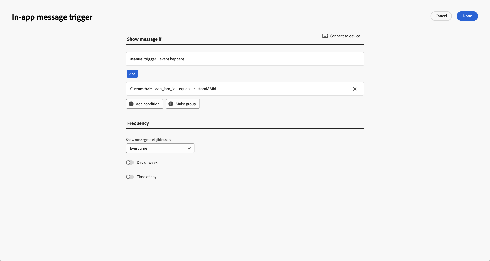
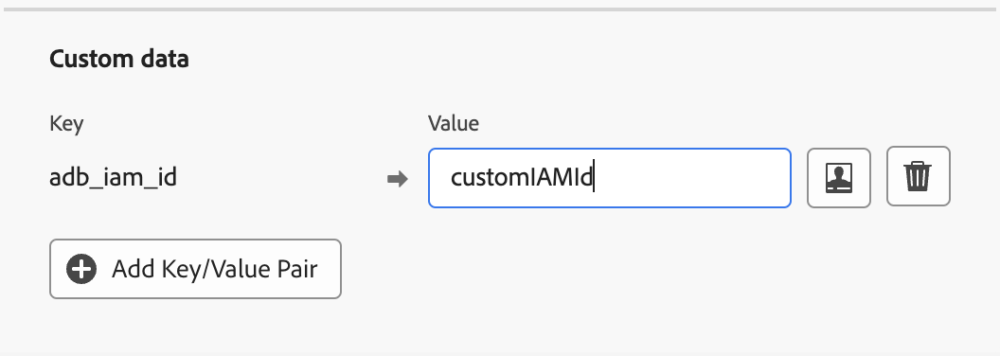

# Display an in-message when a push notification is clicked

## Overview
This document describes the steps that allow a designated in-app message to be shown to an end user when they interact with a push notification to open the app.

## Add a trigger in the in-app message campaign

1. In the Journey Optimizer UI, select the Campaign for the in-app message that needs to be shown when a push notification is interacted with.
2. Under the **Triggers** section, click on the **Edit triggers** button. Click on **Add Condition** and select the **Manual trigger** from the event dropdown. Click on **Add Condition** again and select **Custom trait** from the trait menu. Enter `adb_iam_id` as the key for the custom trait and an id that uniquely identifies the in-app message as the value. Make a note of this id as it will be used in the next step.

> **Note** : The above rule to show the in-app message when the app is opened from a push notification interaction can be combined with existing trigger rules based on other events using an **OR** operator.



3. Click on **Done** to save the rule and review the changes by clicking on **Review to activate**

4. Click on **Request approval** to activate the campaign.

## Add the in-app message ID to the push notification data

1. In the Journey Optimizer UI, select the Campaign for the Push notification which opens the app and shows the in-app message from the previous step.
2. Click **Edit content** to modify the push notification payload. Under **Custom data** section, click on **Add Key/Value Pair**. Enter `adb_iam_id` in the key field and the unique in-app message ID from the previous step in the value field.



3. Click on **Review to activate** to save the changes.

4. Click on **Request approval** to activate the campaign.

## Add the data from `MessagingPushPayload` to the notification intent extras

> **Note** : This step can be skipped if your app is [automatically displaying and tracking push notification using AEPMessaging extension](./automatic-handling-and-tracking.md)

Call the [MessagingPushPayload.putDataInExtras(intent)](./../enum-public-classes/messaging-push-payload.md#add-data-to-intent-extras) method to add the push notification data to the intent sent when the notification is clicked or cleared, depending on which action leads to the app to open and display of the in-app message.

##### Example

#### Kotlin

```kotlin
class CustomNotificationService : FirebaseMessagingService() {

    override fun onMessageReceived(message: RemoteMessage) {
        super.onMessageReceived(message)

        // code to create channelId

        val payload = MessagingPushPayload(message)

        val builder = NotificationCompat.Builder(this, channelId)

        // code to build the notification UI

        builder.setContentIntent(PendingIntent.getActivity(this@NotificationService, 0, Intent(this@NotificationService, MainActivity::class.java).apply {
            message.messageId?.let { Messaging.addPushTrackingDetails(this, it, message.data) }

            // add MessagingPushPayload data to the intent sent when the notification is clicked 
            payload.putDataInExtras(this)
            
        }, if(Build.VERSION.SDK_INT >= M) PendingIntent.FLAG_IMMUTABLE else 0))


        builder.setDeleteIntent(PendingIntent.getBroadcast(this@NotificationService, 0, Intent(this@NotificationService.applicationContext, NotificationDeleteReceiver::class.java).apply {
            message.messageId?.let { Messaging.addPushTrackingDetails(this, it, message.data) }

            // add MessagingPushPayload data to the intent sent when the notification is cleared from the notification panel 
            payload.putDataInExtras(this)

        }, if(Build.VERSION.SDK_INT >= M) PendingIntent.FLAG_IMMUTABLE else 0))

        // code to display the notification
    }
}
```

#### Java

```java
public class CustomNotificationService extends FirebaseMessagingService {

    @Override
    public void onMessageReceived(RemoteMessage message) {
        super.onMessageReceived(message);

        // code to create channelId

        MessagingPushPayload payload = new MessagingPushPayload(message);

        NotificationCompat.Builder builder = new NotificationCompat.Builder(this, channelId);

        // code to build the notification UI

        Intent contentIntent = new Intent(this, MainActivity.class);
        if (message.getMessageId() != null) {
            Messaging.addPushTrackingDetails(contentIntent, message.getMessageId(), message.getData());
        }
        // add MessagingPushPayload data to the intent sent when the notification is clicked
        payload.putDataInExtras(contentIntent);
        builder.setContentIntent(PendingIntent.getActivity(this, 0, contentIntent,
                Build.VERSION.SDK_INT >= Build.VERSION_CODES.M ? PendingIntent.FLAG_IMMUTABLE : 0));

        Intent deleteIntent = new Intent(this, MainActivity.class);
        if (message.getMessageId() != null) {
            Messaging.addPushTrackingDetails(deleteIntent, message.getMessageId(), message.getData());
        }
        // add MessagingPushPayload data to the intent sent when the notification is cleared from the notification panel 
        payload.putDataInExtras(deleteIntent);
        builder.setDeleteIntent(PendingIntent.getBroadcast(this, 0, deleteIntent,
                Build.VERSION.SDK_INT >= Build.VERSION_CODES.M ? PendingIntent.FLAG_IMMUTABLE : 0));

        // code to display the notification
    }
}
```

## Track push notification interaction

> **Note** : This step can be skipped if your app is [automatically displaying and tracking push notification using AEPMessaging extension](./automatic-handling-and-tracking.md)

After the application is opened by the user by clicking on the push notification, verify push notification interaction is being tracked using [handleNotificationResponse](./manual-handling-and-tracking.md#tracking-push-notification-interactions) API.


