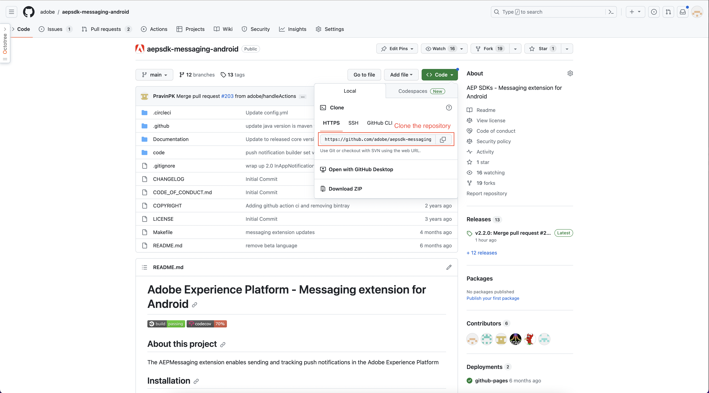
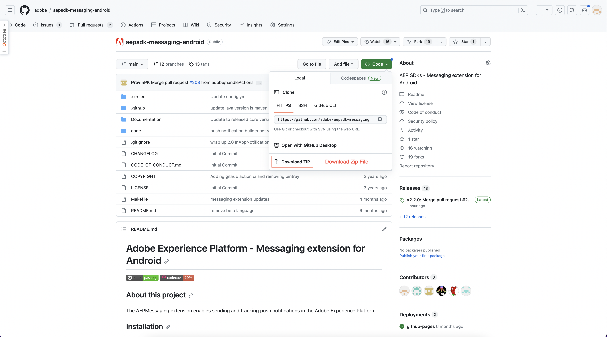
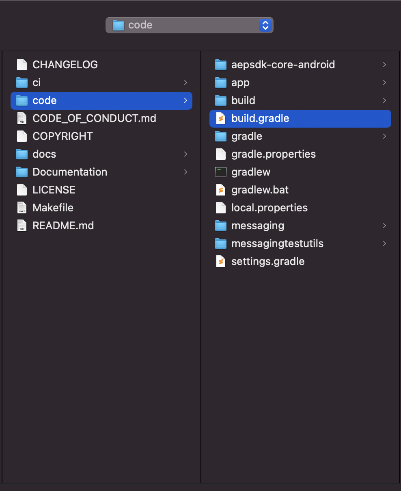
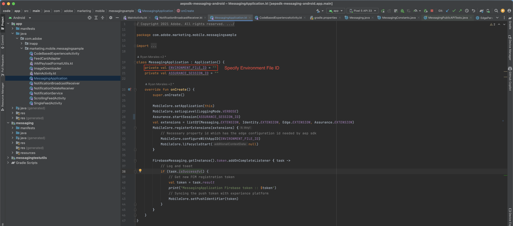
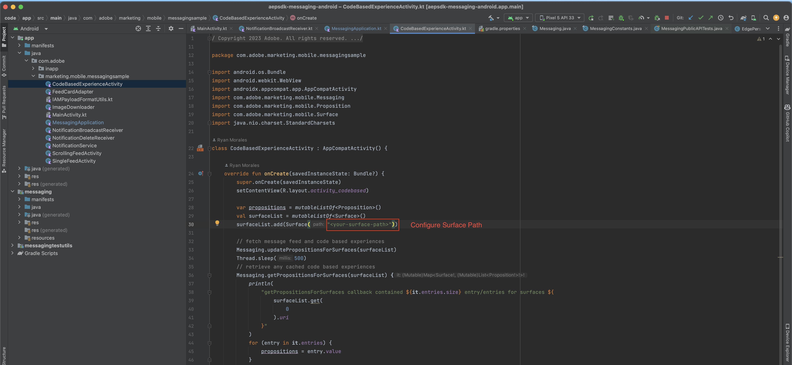
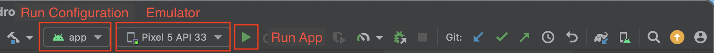

# Test app setup

## Setup

Please follow the below setup steps for Android apps:

1. Install Android Studio - https://developer.android.com/studio

2. Get the Messaging test app from the GitHub repository - https://github.com/adobe/aepsdk-messaging-android by following one of the below options.
    - Option 1: Clone the code from https://github.com/adobe/aepsdk-messaging-android.git. Checkout the `main` branch.
    
    - Option 2: Select the `main` branch and download the code ZIP file.
    

3. Launch Android Studio and open the `build.gradle.kts` file located in the `aepsdk-messaging-android/code` directory.

    

4. Configure the app for the following:
    - Set the `ENVIRONMENT_FILE_ID` value in MessagingApplication.kt (located in the `testapp` directory) for the appropriate environment.
    
    - Modify the surface path in CodeBasedExperienceActivity.kt (located in the `testapp` directory).
    

5. Select the `app` configuration in the Run/Debug configuration dropdown, select the preferred emulator, then run the app.
    

6. For Code Based testing: In the testapp, press the `Check Code Based Experiences` button from the main app screen. You should see the Code-based experiences for the configured surface paths (mobileapp://com.adobe.marketing.mobile.messagingsample/cbe-path1 and mobileapp://com.adobe.marketing.mobile.messagingsample/cbe-path2).

7. For Message Feeds testing: In the testapp, press the `Check Feed Messages` button from the main app screen. You should see the retrieved test feeds for the configured surface (mobileapp://com.adobe.marketing.mobile.messagingsample/feeds/apifeed).